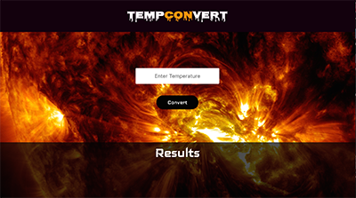

# Table of Contents for Projects

### Intro
This repository contains different projects using JavaScript and React.  The basic version of these projects were developed in the online course _Build Front-End Web Applications from scratch_ at Codecademy.

Below is a list of the different projects with a brief description.

==================================================================
### TempConVert
file: tempconverter

_TempConVert_ is a web app that converts Kelvin to Celsius and Fahrenheit.

The goal of this project was to transform this terminal based app into a web app using React.

link to project proposal  [TempConVert proposal](./docs/mapping/tempconverter/docs/my_proposal.md)

link to file [TempConVert file](https://github.com/ryhanlon/react_apps_-_games/tree/master/tempconverter

===================================================================

### Rock Paper Scissors!
file: rockPaperScissors

Next project up.

===================================================================

<!--### jammming-->
<!--file: jammming-->

<!---->

<!--_Jammming_ is a React application built using the Spotify API which allows users to search the Spotify library, create a custom playlist and then save it to their Spotify account.-->

<!--link to feature request  [Feature Request](./jammming/jammming_feature_request.txt)-->

<!--link to file [jammming file](https://github.com/ryhanlon/JavaScript-CodeAcademy/tree/master/jammming)-->

===================================================================

<!--### Ravenous-->
<!--file: proRavenous-1-->

<!---->

<!--_Ravenous_ is a React application build using the Yelp API which allows user to search the Yelp library by _Best Match_, _Highest Rated_ and _Most Reviewed_. -->

<!--link to file [proRavenous-1 file](https://github.com/ryhanlon/JavaScript-CodeAcademy/tree/master/proRavenous-1)-->
