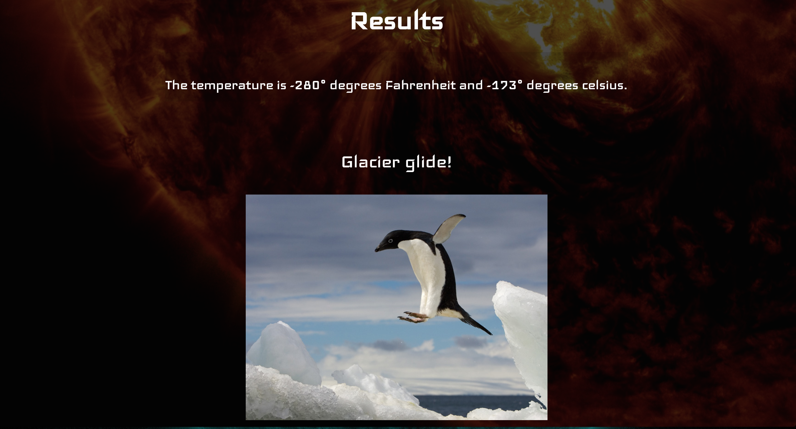
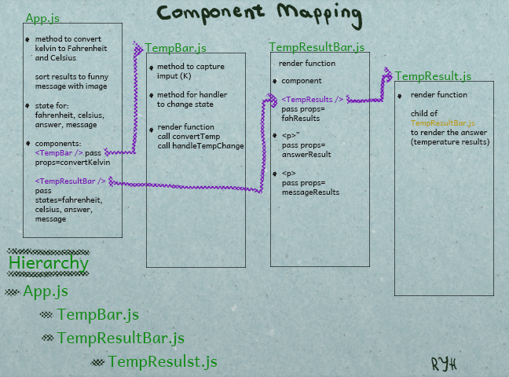

### TempConVert, by Rebecca York Hanlon

### Product Name,
TempConVert

### Product Overview

TempConVert is a web app that converts Kelvin to Celsius and Fahrenheit.  The user enters a number that represents Kalvin, clicks convert and the result is K converted to Fahrenheit and Celsius. 

For this stage I will not focus on the perfect ux design and look of the website, but on the framework and design of components.

The first stage will focus on the following:
1. Design the UX of the app
2. Build a static web page of the application.
3. Build the static Components.
4. Build interactivity by developing the Components using methods, states and props.

### Specific Functionality
This project is a one page app.

****Website Page****

_Page break down:_
- Title Header
- Input bar with button and input
- Result bar with conversion results
- Result bar with a Fun picture and phrase

Here is a visual breakdown of the App Page:

### Data Model

Overview and Breakdown of the Components

- App.js / App.css
- TempBar.js / TempBar.css
- TempResultsBar.js / TempResultsBar.css
- TempResults.js / TempResults.css

Here is a visual breakdown of the props and states:

### Technical Components

- React
- HTML, CSS (Flexbox)
- JavaScript (ECMAScript 6)
- JSX in ECMAScript 6

### Schedule

The beginning of this project was originally completed during the JavaScript portion of the class using the terminal.  The goal of this project is to transform into a web app using React.

****day one - day two:****
- visual design of project's UX 
- begin mapping of static components 
- begin mapping of props, states

****day three - six:****
- Build static Components
- Develop props and states in Components

****day seven - ten:****
- Finish building app
- Finish ReadMe and Project Proposal

### Further Work

Feature Options:
- Show pictures with fun situations that use Kelvin with an example of the K for the user to enter and see the differences in Kelvin, Fahrenheit and Celsius.
- A brief history of Kelvin and it's current usage.
- Add responsiveness to the page.

